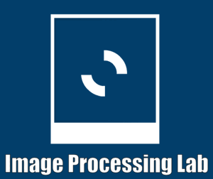

<div align="center">
  
  <h3>Image Processing Lab README</h3>
</div>

# Image Processing Lab Project

 Image Proccessing Lab Website is an **Online Image Editor**. 

# Project Description


It is used in **Resizing, Rotating, Removing Background, Bluring images**.It helps users also in changing Color **(example: Tint)** and making effects on any image **(example: Brightness, GrayScale, Cmyk, Black and White Effect, Sharpness Filter, Median Filter, Normalise Effect and Histogram Effect)**.


## Built With

<ul>
  <li>NodeJS</li>
  <li>AngularJS</li>
  <li>HTML</li>
  <li>CSS</li>
  <li>Bootstrap</li>  
</ul>

## Modules Used in Backend

<ul>
  <li>Express</li>
  <li>cors</li>
  <li>axios</li>
  <li>dotenv</li>
  <li>form-data</li>  
  <li>multer</li>
  <li>remove.bg</li>
  <li>sharp</li> 
</ul>

## Modules Used in Frontend

<ul>
  <li>ngx-toastr</li>
  <li>font-awesome</li>
  <li>tslibs</li>
  <li>zone.js</li>
  <li>angular materials</li>  
</ul>

## Prerequisites   

 Download and setup npm and nodejs


# How to Install and Run the Project


 1. Clone this repo

   ```sh
      git clone https://github.com/AliFathy-1999/Image-Processing-Lab.git
   ```
2. Install all dependencies needed in this project through</li>


  * To install all Frontend Dependencies & Install the CLI using the npm package manager:

  ```sh
      cd frontend
      npm install -g @angular/cli
      npm install
  ```
  * To install all Backend Dependencies

  * if you’re in your home folder

   ```sh
      npm install
   ```

  * if you’re in frontend folder and you want to go back 

   ```sh
      cd ..
      npm install
   ```

3. Run The Project
   
* Make sure you’re in your **home folder** 
      ```sh
      npm run all
   ``` 

# How to Use the Project

* Make Sure that you upload image of type **tiff, png, jpg and jpeg** and maxmium size is **20 migabytes** 

1. How to **Resize Image**:
    1. Uploads image.
    2. Enter image width and height **width and height values between 10 and 1500**. 
    3. Click on Resize Image button to apply resize. 
    4. Click on download image button.

2. How to **Remove Background** from image (Make image transparency):
    1. Uploads image.
    2. Click on Background Remove button to apply transparency. 
    3. Click on download image button.

3. How to **Rotate Image**:
